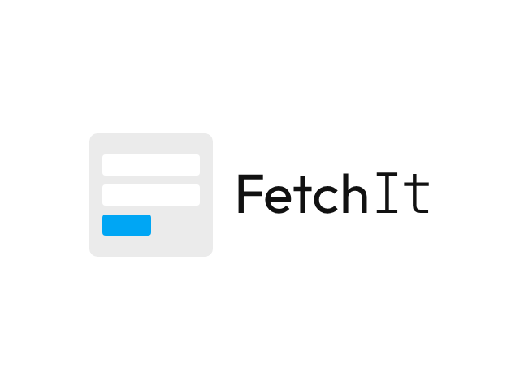
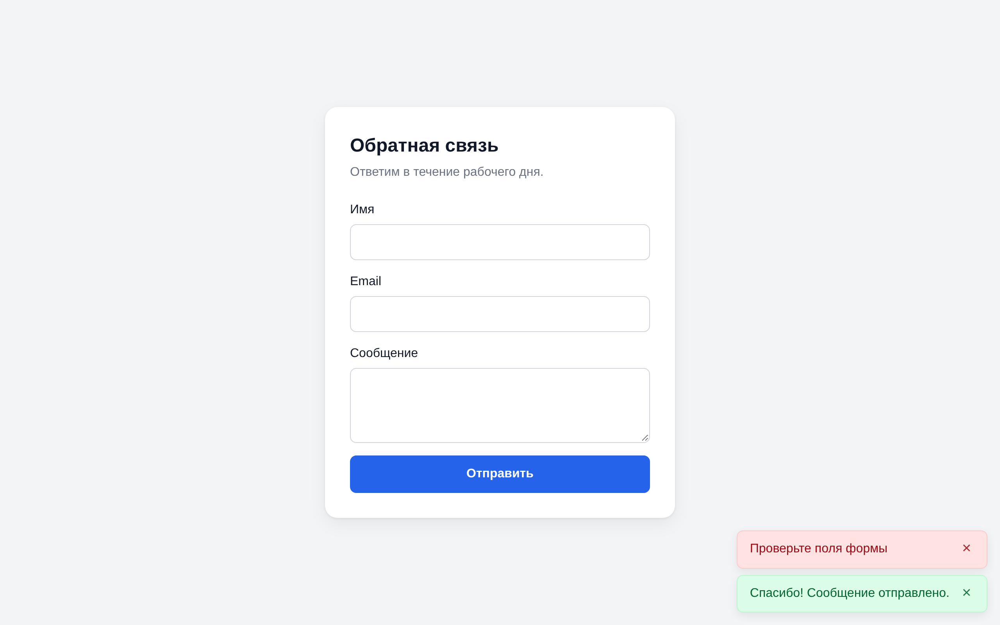

<p align="center">
  <picture>
    <source media="(prefers-color-scheme: dark)" srcset=".github/logo/logo-dark@2x.png">
    
  </picture>
</p>

**Формы на MODX без перезагрузки страницы, с защитой от спама из коробки.**

[](https://modx.com/)
[](https://www.php.net/)
[](#typescript)
[](https://github.com/GulomovCreative/FetchIt/actions/workflows/ci.yml)
[](core/components/fetchit/docs/license.txt)

FetchIt отправляет формы на сайте MODX через Fetch API: без перезагрузки страницы, без jQuery и других библиотек. Обрабатывает их [FormIt](https://github.com/Sterc/FormIt) со всеми его хуками и валидацией или ваш сниппет. Каждая форма сразу защищена от спама: одноразовый токен, время заполнения, поле-ловушка и лимит отправок, а при необходимости proof-of-work и капча. Один пакет для MODX 2.8 и MODX 3.

## Содержание

- [Возможности](#возможности)
- [Установка](#установка)
- [Быстрый старт](#быстрый-старт)
- [Параметры сниппета](#параметры-сниппета)
- [Защита от спама](#защита-от-спама)
- [Уведомления](#уведомления)
- [События и JavaScript](#события-и-javascript)
- [TypeScript](#typescript)
- [Системные настройки](#системные-настройки)
- [Переход на FetchIt 4](#переход-на-fetchit-4)
- [Требования](#требования)
- [Разработка](#разработка)
- [Лицензия](#лицензия)

## Возможности

- **FormIt из коробки.** Параметры вроде `&hooks`, `&validate`, `&emailTo` передаются в FormIt как есть, без обёрток. Вместо FormIt можно указать свой сниппет, который возвращает JSON (`success`, `message`, `data`).
- **Своя вёрстка.** Нужны только чанк формы и атрибуты: `data-error` для ошибок полей, `data-success` и `data-validation-error` для сообщений формы. Классы для полей с ошибкой задаются в системных настройках.
- **Работает и без JavaScript.** С FormIt форма отправляется обычным способом, сообщения и введённые значения выводятся его плейсхолдерами. Кроме случая, когда включены proof-of-work или капча: им нужен JavaScript.
- **Защита от спама по умолчанию:** одноразовый подписанный токен, минимальное время заполнения, скрытое поле-ловушка и лимит отправок. По желанию proof-of-work и капча: Cloudflare Turnstile, Google reCAPTCHA v3 или Яндекс SmartCaptcha. Свои правила добавляются плагином.
- **Никаких зависимостей.** Скрипт не тянет jQuery и сторонних библиотек, использует нативные Fetch API и `FormData` (с файлами). Подключается с `defer`, других файлов не грузит, кроме скрипта сервиса капчи, если она включена.
- **Встроенные уведомления** или свои через `FetchIt.Message`: Bootstrap, SweetAlert2, что угодно.
- **События** `fetchit:before`, `fetchit:after`, `fetchit:success`, `fetchit:error`, `fetchit:reset`: дополнить данные, отменить отправку, показать модалку.
- **Типы для TypeScript** лежат рядом со скриптом.
- **Несколько форм на странице**, каждая со своим ключом и обработчиком, если вызовы сниппета различаются параметрами.
- **Fenom и `@FILE`-чанки** через pdoTools на MODX 2 и MODX 3.

## Установка

FetchIt бесплатно ставится через Менеджер пакетов из официального репозитория [modx.com](https://modx.com/extras/package/fetchit) или из маркетплейса [modstore.pro](https://modstore.pro/packages/utilities/fetchit) ([как подключить репозиторий](https://modstore.pro/faq)). Если FormIt не установлен, установщик скачает его из репозитория modx.com; если это не удалось, об этом будет сказано в журнале установки, и FormIt нужно поставить вручную.

Пакет можно собрать и из этого репозитория, см. [Разработка](#разработка).

## Быстрый старт

Вызов сниппета там, где должна быть форма. Вызов обязательно некешируемый (`[[!FetchIt]]`): у каждого вывода формы свой токен, а скрипт подключается, только если сниппет сработал в этом запросе.

```modx
[[!FetchIt?
  &form=`myForm.tpl`
  &hooks=`email`
  &emailTo=`info@example.com`
  &emailSubject=`Заявка с сайта`
  &validate=`name:required,email:email:required`
  &successMessage=`Сообщение отправлено`
]]
```

Чанк `myForm.tpl`, обычная форма с атрибутами FetchIt:

```html
<form action="[[~[[*id]]]]" method="post">
  <label>Имя
    <input type="text" name="name" value="[[+fi.name]]">
    <span data-error="name">[[+fi.error.name]]</span>
  </label>
  <label>Email
    <input type="email" name="email" value="[[+fi.email]]">
    <span data-error="email">[[+fi.error.email]]</span>
  </label>
  <button type="submit">Отправить</button>

  <div data-success style="display: [[+fi.success:is=`1`:then=``:else=`none`]]">[[+fi.successMessage]]</div>
  <div data-validation-error style="display: [[+fi.validation_error:is=`1`:then=``:else=`none`]]">[[+fi.validation_error_message]]</div>
</form>
```

- `data-error="name"` получает текст ошибки поля `name`, а само поле получает `aria-invalid` и класс из `fetchit.frontend.input.invalid.class`.
- `data-custom="name"` (необязательно) получает класс из `fetchit.frontend.custom.invalid.class`: например, обёртка поля.
- `data-success` и `data-validation-error` показывают сообщение формы.
- Плейсхолдеры `[[+fi.…]]` нужны для отправки без JavaScript. Если это не важно, их можно не ставить.

FetchIt сам добавит в форму ключ `data-fetchit`, служебные поля защиты и подключит скрипт. Готовый пример есть в чанке `tpl.FetchIt.example`.

Подробная [документация](https://docs.modx.pro/components/fetchit/) с примерами: разметка, уведомления, модалки, клиентская валидация, JS API.

## Параметры сниппета

| Параметр | По умолчанию | Что делает |
|---|---|---|
| `form` | `tpl.FetchIt.example` | Чанк формы. С pdoTools можно `@FILE`, `@INLINE` и Fenom |
| `snippet` | `FormIt` | Сниппет, который обрабатывает форму, см. ниже |
| `actionUrl` | `[[+assetsUrl]]action.php` | Адрес, на который отправляется форма |
| `clearFieldsOnSuccess` | `1` | Очистить поля после успешной отправки |

Остальные параметры передаются обрабатывающему сниппету: для FormIt это `&hooks`, `&validate`, `&emailTo`, `&successMessage`, `&placeholderPrefix` и все прочие.

Свой сниппет получает отправленные поля в `$fields` (без служебных полей защиты) и возвращает ответ через FetchIt:

```php
$FetchIt = FetchIt::service($modx);
if (empty($fields)) {
    // Вывод формы, а не отправка: сниппет вызывается и при каждом выводе.
    return '';
}
if (empty($fields['email'])) {
    return $FetchIt->error('Проверьте форму', ['email' => 'Укажите email']);
}
// ... сохранить, отправить письмо
return $FetchIt->success('Спасибо, заявка принята');
```

Проверка `empty($fields)` обязательна: сниппет вызывается и при каждом выводе формы, с пустым `$fields`, иначе он, например, отправит пустое письмо на каждый просмотр страницы. При отправке без JavaScript ответ сниппета не выводится: сообщение на странице покажется, только если сниппет сам поставит плейсхолдеры.

## Защита от спама

Каждая форма FetchIt защищена без настройки. Проверки проходят до FormIt или вашего сниппета, и при отправке через FetchIt, и при обычной отправке формы без JavaScript:

- **Токен.** В форму добавляется скрытое поле `fetchit_token` с подписью ключа формы, времени вывода и случайного числа. Токен одноразовый и не требует сессии. Новый токен выдаётся только в ответ на правильно подписанный токен этой формы, так что бот без загрузки страницы не отправит форму. Ответ на отправку с правильно подписанным токеном приносит следующий токен (кроме отказа по лимиту), и форму можно отправлять повторно без перезагрузки.
- **Время заполнения.** Форма, отправленная быстрее `fetchit.protection.min_time` секунд после вывода страницы (по умолчанию 3), отклоняется. Повторная отправка считается от того же вывода, поэтому человек, который исправил поле после ошибки, отказ не получит.
- **Ловушка.** Скрытое поле со случайным для каждой установки именем люди не видят, а автозаполнение браузера его не узнаёт. Если оно заполнено, бот получает ответ об успешной отправке с `successMessage` формы, но форма не обрабатывается и письмо не уходит. Такие случаи пишутся в журнал.
- **Лимит.** Не больше `fetchit.protection.rate_limit` отправок одной формы с одного адреса за `fetchit.protection.rate_window` секунд (по умолчанию 10 за 10 минут). Считаются все попытки с правильно подписанным токеном, в том числе отклонённые, так что повтором старого токена лимит не обойти.

Служебные поля убираются из `$_POST` до FormIt, в письма они не попадают. Ключ подписи генерируется при установке пакета (`fetchit.protection.secret`).

### Proof-of-work и капча

Обе проверки выключены по умолчанию и нужны, если спам проходит через основные. Работают они, только когда включена защита (`fetchit.protection`).

**Proof-of-work.** `fetchit.protection.pow` задаёт сложность в битах: 0 выключает, больше 24 не бывает (значение сверх этого или не число пишется в журнал и заменяется). Перед отправкой браузер ищет число `n`, для которого SHA-256 от `токен:n` начинается с этого количества нулевых бит, и отправляет его в поле `fetchit_pow`. Решение начинается, как только посетитель зашёл в форму, так что к нажатию кнопки оно обычно готово, а боту каждая отправка стоит работы процессора. При 16 битах в среднем нужно около 65 тысяч хешей: компьютеру около трети секунды, телефону в несколько раз больше. Каждый следующий бит удваивает время, 20 бит примерно в 16 раз дольше. Если страница из кеша просит меньше, чем сервер, FetchIt сам решит задачу заново и отправит форму ещё раз. Форму без JavaScript при включённом proof-of-work отправить нельзя.

**Капча.** В `fetchit.captcha` укажите `turnstile` (Cloudflare Turnstile), `recaptcha` (Google reCAPTCHA v3) или `smartcaptcha` (Яндекс SmartCaptcha), а в `fetchit.captcha.site_key` и `fetchit.captcha.secret_key` ключи из кабинета сервиса. Пока не заданы оба ключа, капча не включается, а в журнал пишется, чего не хватает (так же с опечаткой в названии сервиса). FetchIt сам подключает скрипт сервиса и получает ответ перед отправкой:

- Turnstile выводит виджет в блоке `.fetchit-captcha` перед первой кнопкой с `type="submit"`, а если такой нет, в конце формы;
- reCAPTCHA v3 работает без виджета, ответ запрашивается при каждой отправке с действием `fetchit`. Ответ с оценкой ниже `fetchit.captcha.min_score` (по умолчанию 0.5) отклоняется;
- SmartCaptcha работает в невидимом режиме и показывает задание, только если сомневается.

Ответ проверяется на сервере последним из проверок защиты (плагины `OnFetchItBeforeProcess` вызываются после него), так что боты без токена до сервиса капчи не доходят. Отказ сервиса в ответе посетитель видит как `fetchit_err_captcha`. Если сервис не отвечает, отвечает ошибкой или не принимает секретный ключ, форма тоже отклоняется, но с сообщением `fetchit_err_captcha_unavailable` («проверка сейчас недоступна»), а причина пишется в журнал. Если скрипт сервиса не загрузился (блокировщик рекламы, CSP), посетитель закрыл задание или виджет выдал ошибку, форма не отправляется, а посетитель видит `fetchit_err_captcha_client`. Капча работает только через FetchIt, форма без JavaScript её не пройдёт.

Для проверки на сайте разработки у Turnstile есть [тестовые ключи](https://developers.cloudflare.com/turnstile/troubleshooting/testing/): сайт `1x00000000000000000000AA`, секрет `1x0000000000000000000000000000000AA`.

### Что видит посетитель

Отказ приходит как обычная ошибка формы: сообщение `fetchit_err_token` (форма устарела), `fetchit_err_too_fast`, `fetchit_err_rate`, `fetchit_err_store`, `fetchit_err_pow`, `fetchit_err_captcha` или `fetchit_err_captcha_unavailable` из лексикона, событие `fetchit:error` и уведомление. Если токен страницы устарел (страница из кеша, была долго открыта, сменился ключ), FetchIt сам один раз отправит форму заново с новым токеном, и посетитель ничего не заметит. Без JavaScript сообщение выводится в `[[+fi.validation_error_message]]`, а введённые значения сохраняются, как в примере `tpl.FetchIt.example`.

### Что стоит учесть

- **Кеш всей страницы** (nginx, CDN, плагины статического кеша) отдаёт всем посетителям один и тот же токен. Через FetchIt это работает за счёт повторной отправки, но страницы с формами лучше исключить из такого кеша: без JavaScript первая отправка будет отклонена.
- **FormIt 5.2 и новее** умеет отправлять формы через AJAX сам. Для форм FetchIt этот режим выключается: FetchIt убирает сохранённые FormIt параметры, плейсхолдер `fi.ajaxToken` и скрипт `formit.js`, иначе форму можно было бы отправить через `action.php` FormIt в обход защиты. Формы, которые на той же странице выводит сам `[[!FormIt]]`, свой AJAX-режим сохраняют. reCAPTCHA из FormIt 5.2 получает ответ через `formit.js`, поэтому в формах FetchIt она не работает: включайте капчу через `fetchit.captcha`. Хуки капчи, которые читают ответ из своего поля сами, работают, пока в `fetchit.captcha` не выбран тот же сервис.
- **Формы, вставленные на страницу через AJAX** после её загрузки, FetchIt сам не подхватывает: скрипт находит формы при загрузке страницы. Такие формы отправятся обычным способом.
- **Свой JS вместо встроенного скрипта** должен отправлять форму на `action.php` с заголовком `X-FetchIt-Action`, равным атрибуту `data-fetchit` формы, и полем `pageId` с id страницы. Он должен отправлять поле `fetchit_token` из формы и после каждого ответа брать следующий токен из заголовка `X-FetchIt-Token`. Если ответ пришёл с заголовком `X-FetchIt-Refused: token`, отправьте форму ещё раз с новым токеном. С proof-of-work нужно отправлять в `fetchit_pow` решение для того токена, который уходит в этом запросе, и решать заново при повторе. При отказе `pow` заголовок `X-FetchIt-Pow` сообщает нужную сложность. С капчей нужно отправлять ответ сервиса в его поле (`cf-turnstile-response`, `g-recaptcha-response` или `smart-token`), а reCAPTCHA v3 выполнять с действием `fetchit`.
- **За прокси или CDN** все посетители приходят с одного адреса, и лимит становится общим на сайт. Перечислите адреса прокси в `fetchit.protection.proxies` (IP или CIDR через запятую) и заголовок с адресом посетителя в `fetchit.protection.ip_header` (`X-Forwarded-For`, `CF-Connecting-IP`).
- **Отметки использованных токенов** хранятся в `core/cache/fetchit/tokens/`, «Очистить кеш» их не трогает. Если папка недоступна для записи, формы отклоняются, а причина пишется в журнал (если он не выключен). На нескольких серверах без общего `core/cache` токен можно использовать по разу на каждом сервере.
- **Журнал:** `fetchit.protection.log` 0 выключает его, 1 (по умолчанию) пишет проблемы и отказы, которые могут задеть людей (ловушка, лимит, запись отметок, недоступный сервис капчи), 2 пишет все отказы, в том числе ответы капчи, которые сервис не принял. Ошибки в настройках капчи и proof-of-work пишутся всегда.
- **На сайте для разработки** и в автотестах поставьте `fetchit.protection.min_time` и `fetchit.protection.rate_limit` в 0. Выключать всю защиту (`fetchit.protection`) стоит только для отладки.

### Свои правила

Плагин на событие `OnFetchItBeforeProcess` получает `$action`, `$fields` (отправленные поля без служебных и без файлов), `$properties` (может быть `null`) и `$FetchIt`. Чтобы отклонить отправку, он выводит сообщение для посетителя или ключ лексикона через `$modx->event->output()`. Возврат строки через `return` отправку не отклоняет: MODX только запишет её в журнал.

```php
// Плагин на событие OnFetchItBeforeProcess
$email = isset($fields['email']) && is_string($fields['email']) ? $fields['email'] : '';
if (preg_match('/@(mailinator|tempmail)\./i', $email)) {
    $modx->event->output('Одноразовые адреса не принимаются.');
}
```

Событие срабатывает и при выключенной защите.

## Уведомления



С настройкой `fetchit.frontend.default.notifier` ответы сервера и ошибки отправки показываются ещё и уведомлениями в углу страницы. Текст выводится как текст: теги из него убираются, HTML-сущности вроде `&amp;` остаются как есть.

- Программы экранного доступа читают уведомления из двух скрытых live-областей, которые есть на странице заранее: ошибку сразу (`role="alert"`), успех в свою очередь (`role="status"`).
- Уведомление закрывается кнопкой или само через 6 секунд. Пока на нём курсор или фокус, отсчёт стоит, а потом начинается заново. Если закрыть уведомление с клавиатуры, фокус перейдёт на соседнее уведомление или вернётся туда, откуда пришёл.
- Одновременно видно не больше трёх. Уведомление, на котором фокус, лишним не считается.

Стили подключаются первыми в `<head>`, с селекторами из одного класса. Они сильнее общих правил сайта для элементов (`button { … }`) и проигрывают любому правилу сайта с классом. Правила внутри `@layer` (например, в Tailwind 4) им проигрывают, для них проще менять переменные. По умолчанию это пастельные цвета Tailwind CSS 4, как в его алертах: фон из оттенка 100, рамка из 200, текст из 800 (контраст текста около 6.5:1, с запасом для WCAG AA). Там, где браузер понимает `oklch()`, они заданы точно, в остальных браузерах в hex:

```css
.fetchit-toasts {
  --fetchit-toast-success-bg: oklch(96.2% 0.044 156.743);     /* green-100, #dcfce7 */
  --fetchit-toast-success-border: oklch(92.5% 0.084 155.995); /* green-200, #b9f8cf */
  --fetchit-toast-success-text: oklch(44.8% 0.119 151.328);   /* green-800, #016630 */
  --fetchit-toast-error-bg: oklch(93.6% 0.032 17.717);        /* red-100, #ffe2e2 */
  --fetchit-toast-error-border: oklch(88.5% 0.062 18.334);    /* red-200, #ffc9c9 */
  --fetchit-toast-error-text: oklch(44.4% 0.177 26.899);      /* red-800, #9f0712 */
}
```

На сайте с Tailwind 4 можно взять его переменные, например `--fetchit-toast-success-bg: var(--color-emerald-100)`.

Если на сайте Content-Security-Policy запрещает встроенные стили (`style-src` без `'unsafe-inline'`), дайте скрипту FetchIt `nonce`: стили получат тот же. Иначе FetchIt предупредит в консоли, и уведомления придётся оформить самим.

Свой `FetchIt.Message` важнее настройки. Если в нём нет ни `success`, ни `error` (например, только спиннер в `before` и `after`), встроенные уведомления их добавят, если `FetchIt.Message` задан до `DOMContentLoaded`: прямо в отложенном скрипте, который подключён после `fetchit.js`. Включить уведомления можно и из своего скрипта, с другой подписью кнопки или временем показа (`0` значит «пока не закроют»): `FetchIt.Message = FetchIt.createNotifier({ closeLabel: 'Закрыть', duration: 4000 })`.

До FetchIt 4 настройка подключала библиотеку Notyf. Теперь её нет: стили для `.notyf__toast` и скрипты, которые вызывают `new Notyf()`, нужно поменять или подключить Notyf самим.

## События и JavaScript

События приходят на `document` и не всплывают. В `event.detail` лежат форма (`form`), её данные (`formData`) и экземпляр FetchIt (`fetchit`), а начиная с `fetchit:after` ещё и ответ сервера (`response`). У `fetchit:error` без ответа есть причина (`error`), у `fetchit:reset` только `form` и `fetchit`.

| Событие | Когда | Отмена (`event.preventDefault()`) |
|---|---|---|
| `fetchit:before` | перед отправкой, в `formData` можно дописать поля | форма не отправляется |
| `fetchit:after` | пришёл ответ FetchIt | ответ не обрабатывается: ни ошибок полей, ни сообщения, ни уведомления, ни событий `fetchit:success` и `fetchit:error`, ни очистки |
| `fetchit:success` | форма принята | поля не очищаются |
| `fetchit:error` | форма отклонена или не отправилась; `response` равен `null`, если ответа FetchIt нет, причина в `error` | ошибки полей и сообщение формы не выводятся |
| `fetchit:reset` | форму сбрасывают: кнопкой, `form.reset()` или после успешной отправки; значения полей в этот момент ещё прежние | нельзя |

```js
document.addEventListener('fetchit:before', ({ detail }) => {
  detail.formData.append('page', location.pathname)
})

document.addEventListener('fetchit:success', ({ detail }) => {
  ym(12345678, 'reachGoal', 'form_' + detail.form.id)
})
```

`FetchIt.Message` принимает хуки `before`, `after(message)`, `success(message)`, `error(message)` и `reset`. Они вызываются перед событием того же момента (кроме `reset`: он после `fetchit:reset`), так что отмена события их не отменяет:

```js
FetchIt.Message = {
  success (message) { Swal.fire({ icon: 'success', text: message }) },
  error (message) { Swal.fire({ icon: 'error', text: message }) },
}
```

Глобальный `FetchIt` появляется, когда отработал отложенный `fetchit.js`, поэтому `FetchIt.Message` задавайте из отложенного скрипта, подключённого после него, или по `DOMContentLoaded`. Экземпляр формы: `FetchIt.instances.get(form)`, у него есть `setError(name, message)`, `clearErrors()`, `setFormMessage(type, message)` и другие методы.

## TypeScript

Типы лежат в `assets/components/fetchit/js/fetchit.d.ts`. Скопируйте файл в проект или подключите его:

```ts
/// <reference path="../assets/components/fetchit/js/fetchit.d.ts" />

document.addEventListener('fetchit:error', event => {
  // response равен null, если ответа FetchIt нет: сеть, чужой ответ, капча без ответа
  if (event.detail.response === null) {
    console.error(event.detail.error)
  }
})

const form = document.querySelector('form')
if (form) {
  FetchIt.instances.get(form)?.setError('email', 'Проверьте адрес')
}
```

Скрипт проверяется по этому же файлу: и `FetchIt` с экземплярами форм, и `detail` каждого события, так что типы и код не расходятся. Уберите своё объявление `FetchIt`, если оно было (`declare var FetchIt: any`): они будут конфликтовать.

## Системные настройки

Все настройки в пространстве имён `fetchit`.

| Настройка | По умолчанию | Что делает |
|---|---|---|
| `fetchit.frontend.js` | `[[+assetsUrl]]js/fetchit.js` | Скрипт FetchIt. Минифицированный `js/fetchit.min.js` весит около 19 КБ вместо 36 (в gzip около 7 КБ вместо 10) |
| `fetchit.frontend.js.classname` | `FetchIt` | Класс, который обрабатывает формы, если вы расширили встроенный |
| `fetchit.frontend.input.invalid.class` | `is-invalid` | Класс поля с ошибкой |
| `fetchit.frontend.custom.invalid.class` | | Класс для элементов `data-custom` поля с ошибкой |
| `fetchit.frontend.default.notifier` | `Нет` | Показывать ответы встроенными [уведомлениями](#уведомления) |
| `fetchit.protection` | `Да` | [Защита от спама](#защита-от-спама). Выключайте только для отладки |
| `fetchit.protection.secret` | случайный | Ключ подписи токенов, генерируется при установке |
| `fetchit.protection.min_time` | `3` | Минимальное время заполнения, секунд; 0 выключает |
| `fetchit.protection.token_ttl` | `86400` | Сколько секунд страница с формой остаётся действительной; 0 и всё, что больше 30 дней, значит 30 дней |
| `fetchit.protection.rate_limit` | `10` | Отправок одной формы с одного адреса за окно; 0 выключает |
| `fetchit.protection.rate_window` | `600` | Окно лимита, секунд; 0 выключает лимит |
| `fetchit.protection.log` | `1` | Журнал защиты: 0 ничего, 1 проблемы, 2 все отказы |
| `fetchit.protection.proxies` | | Доверенные прокси или CDN, IP или CIDR через запятую |
| `fetchit.protection.ip_header` | `X-Forwarded-For` | Заголовок с адресом посетителя от доверенного прокси |
| `fetchit.protection.pow` | `0` | Сложность proof-of-work, бит; 0 выключает, не больше 24 |
| `fetchit.captcha` | | `turnstile`, `recaptcha` или `smartcaptcha`; пусто без капчи |
| `fetchit.captcha.site_key` | | Ключ сайта у сервиса капчи |
| `fetchit.captcha.secret_key` | | Секретный ключ у сервиса капчи |
| `fetchit.captcha.min_score` | `0.5` | reCAPTCHA v3: минимальная оценка, от 0 до 1 |

## Переход на FetchIt 4

FetchIt 4 это один пакет для MODX 2.8 и MODX 3 вместо линий 1.x и 3.x. Он ставится поверх установленной версии через Менеджер пакетов: системные настройки и чанки остаются как есть. Сниппет и плагин FetchIt при обновлении заменяются вместе с параметрами сниппета по умолчанию, так что правки в их коде и параметрах пропадут; вызовы сниппета на страницах менять не нужно. Обновление проверяется в CI с 1.1.3 на MODX 2 и с 3.1.4 на MODX 3.

Прежний API работает на обеих версиях MODX:

- в своих сниппетах берите FetchIt так: `$FetchIt = FetchIt::service($modx);`. Вызовы из 1.x (`$modx->getService('fetchit', 'FetchIt', MODX_CORE_PATH . 'components/fetchit/model/')`) и из 3.x (`$modx->services->get('FetchIt')`, только на MODX 3) возвращают тот же объект;
- класс `FetchIt\FetchIt` из 3.x это тот же класс, `instanceof \FetchIt\FetchIt` работает. `get_class()` теперь возвращает `FetchIt`;
- `storeActionProperties()`/`loadActionProperties()` и их имена из 3.x `saveActionProperties()`/`getActionProperties()`;
- чанки через pdoTools (Fenom, `@FILE`) на MODX 2 и MODX 3.

Что может задеть ваш код:

- в форму добавляются служебные поля защиты; свой JS вместо встроенного должен отправлять токен (см. [Что стоит учесть](#что-стоит-учесть));
- настройка уведомлений больше не подключает Notyf (см. [Уведомления](#уведомления));
- `fetchit:error` срабатывает и при сбое запроса; тогда `detail.response` равен `null`, а ошибка лежит в `detail.error`;
- обрабатывающий сниппет получает в `fields` только отправленную форму: `$_POST` и файлы из `$_FILES` при отправке через FetchIt, только `$_POST` при обычной отправке формы; без GET-параметров и cookies;
- `fetchit:success` можно отменить: `event.preventDefault()` оставит поля заполненными;
- повторная отправка, пока идёт запрос, игнорируется;
- `method` и `data-fetchit` ставятся последними атрибутами тега формы.

Полный список изменений в [changelog](core/components/fetchit/docs/changelog.txt).

## Требования

- MODX 2.8 или MODX 3 (проверяется на 2.8.6 и 3.2.4).
- PHP 7.4 или новее. Синтаксис и PHPUnit проверяются на PHP 7.4–8.4, установка и отправка форм на MODX на PHP 7.4 и 8.3.
- FormIt, если формы обрабатывает он; ставится вместе с FetchIt.
- pdoTools, если чанки форм на Fenom или в файлах.
- Браузеры из `browserslist` в `package.json` (актуальные версии всех основных браузеров): скрипт собирается в синтаксис ES2019, и CI это проверяет. Без JavaScript формы с FormIt работают как обычные, если не включены proof-of-work и капча.

## Разработка

### Окружение

Нужны Node.js 22.22+, 24.15+ или 26+ (версия для CI в `.node-version`), PHP 7.4+ с Composer и Docker.

```sh
npm ci && composer install

npm run build        # src/ → assets/components/fetchit/js/: скрипт в ES2019 и fetchit.d.ts
npm run check:syntax # собранный скрипт разбирается как ES2019
npm run lint         # oxlint
npm run typecheck    # tsc: код и собранные публичные типы глазами сайта (tests/types, после npm run build)
npm test             # Vitest
vendor/bin/phpunit   # PHPUnit
npm run screenshots  # снимки уведомлений в docs/images/, после правок их стилей
npm run logo         # логотип из .github/logo/logo.html (нужна сеть для Google Fonts)
```

### Локальные сайты

Два сайта, MODX 2.8.6 на PHP 7.4 и MODX 3.2.4 на PHP 8.3. Папки компонента из репозитория подключены в оба, поэтому правки PHP и собранного JS видны сразу. Правки в `src/` видны после `npm run build`.

```sh
# если ваши uid/gid не 1000: export HOST_UID=$(id -u) HOST_GID=$(id -g)
docker compose up -d --build
docker compose logs -f modx2 modx3   # дождаться строк «[fetchit] Manager: …»
# MODX 2: http://localhost:8052/, MODX 3: http://localhost:8053/ (admin / FetchItDev2026)
```

Пакет собирается на MODX 2 и ставится на оба сайта так же, как в CI:

```sh
docker compose exec -u www-data -e PKG_DIST=1 modx2 php /extra/_build/build.php
docker compose exec -u www-data modx2 php /extra/_build/ci/install.php /extra/_packages/fetchit-<версия>-<релиз>.transport.zip
docker compose exec -u www-data modx3 php /extra/_build/ci/install.php /extra/_packages/fetchit-<версия>-<релиз>.transport.zip
```

Без `PKG_DIST=1` `build.php` сразу ставит пакет на тот сайт, где его собирают. Для проверки обновлений со старых версий есть чистые сайты без папок репозитория, см. `compose.clean.yml`.

Проверки через HTTP и браузерные тесты на локальном сайте:

```sh
fixtures=$(docker compose exec -T -u www-data modx2 php /extra/_build/ci/fixtures.php)
_build/ci/smoke.sh http://localhost:8052 "$fixtures"
npx playwright install chromium
BASE_URL=http://localhost:8052 FIXTURES="$fixtures" npm run e2e
```

### Как устроено

- **Сниппет** (`core/components/fetchit/elements/snippets/`) выводит чанк формы, ставит ей ключ `data-fetchit` (хеш параметров вызова) и служебные поля защиты, запоминает свои параметры по этому ключу и при обычной отправке формы без JavaScript обрабатывает её сам.
- **Плагин** на `OnWebPagePrerender` подключает скрипт в `<head>`, если в этом запросе сработал некешируемый вызов сниппета.
- **Скрипт** (`src/`, собирается в `assets/components/fetchit/js/`) отправляет форму на `action.php` с заголовком `X-FetchIt-Action`, решает proof-of-work, получает ответ капчи, выводит ошибки и сообщения, отправляет события.
- **`action.php`** находит параметры формы по ключу, проверяет защиту и вызывает FormIt или ваш сниппет.
- **`FetchItGuard`** проверяет токен, лимит, ловушку, proof-of-work, время заполнения и капчу (`FetchItCaptcha`), затем вызывает `OnFetchItBeforeProcess`.

### Проверки и релизы

CI проверяет каждый PR: синтаксис PHP 7.4–8.4, PHPUnit, линтер, типы, тесты, актуальность собранного JS и то, что он в синтаксисе ES2019, workflow и shell-скрипты, согласованность версий. Затем собирает пакет на MODX 2.8.6, ставит его на MODX 2.8.6 и 3.2.4, в том числе поверх 1.1.3 и 3.1.4, и отправляет формы через HTTP (с анонимными сессиями и без) и из браузера (Playwright): с защитой, proof-of-work, Turnstile и встроенными уведомлениями.

Релиз:

1. Поднять версию в `_build/config.inc.php` (и при необходимости `release`, например `alpha` → `pl`) и `core/components/fetchit/model/fetchit.class.php`, в `package.json` и `package-lock.json` через `npm version X.Y.Z --no-git-tag-version`.
2. Добавить в `core/components/fetchit/docs/changelog.txt` раздел `## [X.Y.Z] - ГГГГ-ММ-ДД`.
3. Слить это в `master` и запушить тег: `git tag vX.Y.Z && git push origin vX.Y.Z`.

Workflow проверит версию, соберёт пакет, прогонит его на MODX 2 и 3 и только потом создаст GitHub-релиз с пакетом. Заметки к релизу собираются из коммитов `feat`, `fix`, `perf` и `refactor` ([conventional commits](https://www.conventionalcommits.org/ru/)); если таких нет, берётся раздел из changelog.

### Ветки

FetchIt 4 разрабатывается в `master`. Прежние линии больше не развиваются: 1.x для MODX 2 (последний выпуск 1.1.3) осталась в истории `master`, 3.x для MODX 3 (последний выпуск 3.1.4) в ветке `next`.

## Лицензия

[GPL-2.0](core/components/fetchit/docs/license.txt).
