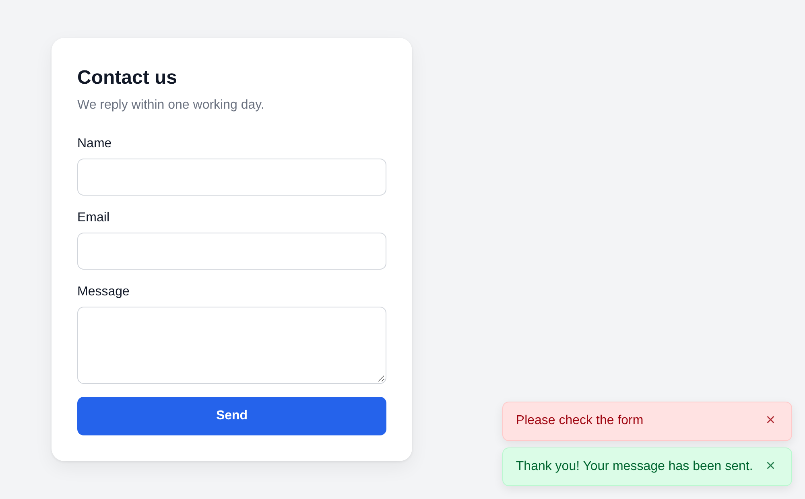

<p align="center">
  <picture>
    <source media="(prefers-color-scheme: dark)" srcset=".github/logo/logo-dark@2x.png">
    
  </picture>
</p>

**MODX forms without a page reload, protected from spam out of the box.**

[](https://modx.com/)
[](https://www.php.net/)
[](#typescript)
[](https://github.com/GulomovCreative/FetchIt/actions/workflows/ci.yml)
[](core/components/fetchit/docs/license.txt)

**English** | [Русский](README.ru.md)

FetchIt submits the forms of a MODX site with the Fetch API: no page reload, no jQuery or other libraries. The forms are processed by [FormIt](https://github.com/Sterc/FormIt), with all its hooks and validation, or by a snippet of your own. Every form is protected from spam from the start: a single-use token, a fill time, a trap field and a limit of submissions, and a proof of work and a captcha when you need them. One package for MODX 2.8 and MODX 3.

## Contents

- [Features](#features)
- [Installation](#installation)
- [Quick start](#quick-start)
- [Snippet properties](#snippet-properties)
- [Spam protection](#spam-protection)
- [Notifications](#notifications)
- [Events and JavaScript](#events-and-javascript)
- [TypeScript](#typescript)
- [System settings](#system-settings)
- [Upgrading to FetchIt 4](#upgrading-to-fetchit-4)
- [Requirements](#requirements)
- [Development](#development)
- [License](#license)

## Features

- **FormIt out of the box.** Properties such as `&hooks`, `&validate` and `&emailTo` go to FormIt as they are, with no wrappers. Instead of FormIt you can name a snippet of your own that returns JSON (`success`, `message`, `data`).
- **Your own markup.** All it takes is a form chunk with attributes: `data-error` for the errors of fields, `data-success` and `data-validation-error` for the messages of the form. The classes of invalid fields are system settings.
- **Works without JavaScript too.** With FormIt the form is sent the usual way, and the messages and the values entered come back through its placeholders. Unless a proof of work or a captcha is on: they need JavaScript.
- **Spam protection by default:** a signed single-use token, a minimum fill time, a hidden trap field and a limit of submissions. Optionally a proof of work and a captcha: Cloudflare Turnstile, Google reCAPTCHA v3 or Yandex SmartCaptcha. Plugins add rules of their own.
- **No dependencies.** The script needs no jQuery or other libraries and uses the native Fetch API and `FormData` (files included). It is loaded with `defer` and loads no other files, except the script of the captcha provider when a captcha is on.
- **Built-in notifications**, or your own through `FetchIt.Message`: Bootstrap, SweetAlert2, anything.
- **Events** `fetchit:before`, `fetchit:after`, `fetchit:success`, `fetchit:error`, `fetchit:reset`: add data, cancel a submission, show a modal.
- **TypeScript types** ship next to the script.
- **Several forms on a page**, each with its own key and handler, as long as the snippet calls differ in their properties.
- **Fenom and `@FILE` chunks** through pdoTools on MODX 2 and MODX 3.

## Installation

FetchIt is free. Install it with the Package Manager from the official [modx.com](https://modx.com/extras/package/fetchit) repository or from the [modstore.pro](https://modstore.pro/packages/utilities/fetchit) marketplace ([how to add the repository](https://modstore.pro/faq)). When FormIt is not installed, the installer downloads it from modx.com; if that fails, the install log says so, and FormIt has to be installed by hand.

You can also build the package from this repository, see [Development](#development).

## Quick start

Call the snippet where the form goes. The call must be uncached (`[[!FetchIt]]`): every output of the form has a token of its own, and the script is added only when the snippet ran in the request.

```modx
[[!FetchIt?
  &form=`myForm.tpl`
  &hooks=`email`
  &emailTo=`info@example.com`
  &emailSubject=`A request from the site`
  &validate=`name:required,email:email:required`
  &successMessage=`Your message has been sent`
]]
```

The chunk `myForm.tpl`, a plain form with the attributes of FetchIt:

```html
<form action="[[~[[*id]]]]" method="post">
  <label>Name
    <input type="text" name="name" value="[[+fi.name]]">
    <span data-error="name">[[+fi.error.name]]</span>
  </label>
  <label>Email
    <input type="email" name="email" value="[[+fi.email]]">
    <span data-error="email">[[+fi.error.email]]</span>
  </label>
  <button type="submit">Send</button>

  <div data-success style="display: [[+fi.success:is=`1`:then=``:else=`none`]]">[[+fi.successMessage]]</div>
  <div data-validation-error style="display: [[+fi.validation_error:is=`1`:then=``:else=`none`]]">[[+fi.validation_error_message]]</div>
</form>
```

- `data-error="name"` gets the error of the field `name`, and the field itself gets `aria-invalid` and the class from `fetchit.frontend.input.invalid.class`.
- `data-custom="name"` (optional) gets the class from `fetchit.frontend.custom.invalid.class`: the wrapper of the field, for example.
- `data-success` and `data-validation-error` show the message of the form.
- The `[[+fi.…]]` placeholders are for submissions without JavaScript. If those do not matter, leave them out.

FetchIt adds the `data-fetchit` key and the service fields of the protection to the form, and adds the script to the page. The chunk `tpl.FetchIt.example` is a ready example.

The [documentation](https://docs.modx.pro/components/fetchit/) (in Russian) has more examples: markup, notifications, modals, client-side validation, the JS API.

## Snippet properties

| Property | Default | What it does |
|---|---|---|
| `form` | `tpl.FetchIt.example` | The chunk of the form. With pdoTools: `@FILE`, `@INLINE` and Fenom |
| `snippet` | `FormIt` | The snippet that processes the form, see below |
| `actionUrl` | `[[+assetsUrl]]action.php` | Where the form is sent |
| `clearFieldsOnSuccess` | `1` | Clear the fields after a successful submission |

All other properties go to the processing snippet: for FormIt, `&hooks`, `&validate`, `&emailTo`, `&successMessage`, `&placeholderPrefix` and the rest.

A snippet of your own gets the fields sent in `$fields` (without the service fields of the protection) and answers through FetchIt:

```php
$FetchIt = FetchIt::service($modx);
if (empty($fields)) {
    // The form is being output, not sent: the snippet runs on every output too.
    return '';
}
if (empty($fields['email'])) {
    return $FetchIt->error('Please check the form', ['email' => 'Enter your email']);
}
// ... save it, send an email
return $FetchIt->success('Thank you, we got your request');
```

The `empty($fields)` check is a must: the snippet also runs on every output of the form, with an empty `$fields`, and without the check it would, for example, send an empty email on every page view. A form sent without JavaScript does not show what the snippet returns: a message appears on the page only if the snippet sets placeholders itself.

## Spam protection

Every FetchIt form is protected with no setup. The checks run before FormIt or your snippet, both for FetchIt submissions and for forms sent without JavaScript:

- **Token.** The form gets a hidden `fetchit_token` field with a signature of the key of the form, the time it was output and a random number. A token is used once and needs no session. A new token is given only in answer to a well-signed token of the same form, so a bot cannot send the form without loading the page. The answer to a submission with a well-signed token brings the next token (except a refusal for the limit), so the form can be sent again without a reload.
- **Fill time.** A form sent sooner than `fetchit.protection.min_time` seconds after the page was output (3 by default) is refused. A second submission counts from the same output, so a person who fixed a field after an error is not refused.
- **Trap.** A hidden field with a random name per installation, which people do not see and browser autofill does not recognise. When it is filled in, the bot gets a success answer with the `successMessage` of the form, but the form is not processed and no email goes out. Such cases are logged.
- **Limit.** At most `fetchit.protection.rate_limit` submissions of a form from one address within `fetchit.protection.rate_window` seconds (10 in 10 minutes by default). Every attempt with a well-signed token counts, refused ones too, so replaying an old token does not get around the limit.

The service fields are removed from `$_POST` before FormIt runs and never reach emails. The signing key is generated when the package is installed (`fetchit.protection.secret`).

### Proof of work and captcha

Both are off by default and help when spam gets through the main checks. They work only with the protection on (`fetchit.protection`).

**Proof of work.** `fetchit.protection.pow` sets the difficulty in bits: 0 turns it off, 24 is the most (a larger value or one that is not a number is logged and replaced). Before sending, the browser looks for a number `n` such that SHA-256 of `token:n` starts with that many zero bits, and sends it in the `fetchit_pow` field. Solving starts as soon as the visitor enters the form, so the solution is usually ready by the time they press the button, while every submission costs a bot processor time. 16 bits take about 65 thousand hashes on average: about a third of a second on a computer, several times longer on a phone. Every bit doubles the time, 20 bits take about 16 times longer. When a page from a cache asks for less than the server, FetchIt solves again and sends the form once more by itself. With a proof of work on, a form cannot be sent without JavaScript.

**Captcha.** Set `fetchit.captcha` to `turnstile` (Cloudflare Turnstile), `recaptcha` (Google reCAPTCHA v3) or `smartcaptcha` (Yandex SmartCaptcha), and `fetchit.captcha.site_key` and `fetchit.captcha.secret_key` to the keys from the provider's dashboard. Until both keys are set, the captcha stays off and the log says what is missing (the same for a misspelt provider). FetchIt adds the provider's script and gets its answer before sending:

- Turnstile shows its widget in a `.fetchit-captcha` block before the first button with `type="submit"`, or at the end of the form when there is none;
- reCAPTCHA v3 has no widget: an answer is asked for each submission, with the action `fetchit`. Answers scoring below `fetchit.captcha.min_score` (0.5 by default) are refused;
- SmartCaptcha works invisibly and shows a puzzle only when in doubt.

The server checks the answer last among the checks of the protection (`OnFetchItBeforeProcess` plugins run after it), so bots without a token never reach the provider. When the provider refuses the answer, the visitor sees `fetchit_err_captcha`. When the provider does not answer, answers with an error or does not accept the secret key, the form is refused too, but with `fetchit_err_captcha_unavailable` ("the check is unavailable right now"), and the cause is logged. When the provider's script did not load (an ad blocker, CSP), the visitor closed the puzzle or the widget failed, the form is not sent and the visitor sees `fetchit_err_captcha_client`. The captcha works only through FetchIt: a form sent without JavaScript does not pass it.

For a development site Turnstile has [test keys](https://developers.cloudflare.com/turnstile/troubleshooting/testing/): site `1x00000000000000000000AA`, secret `1x0000000000000000000000000000000AA`.

### What the visitor sees

A refusal comes as an ordinary error of the form: the lexicon message `fetchit_err_token` (the form has expired), `fetchit_err_too_fast`, `fetchit_err_rate`, `fetchit_err_store`, `fetchit_err_pow`, `fetchit_err_captcha` or `fetchit_err_captcha_unavailable`, the `fetchit:error` event and a notification. When the token of the page is stale (a page from a cache, a page open for long, a new key), FetchIt sends the form once more with a new token by itself, and the visitor notices nothing. Without JavaScript the message goes to `[[+fi.validation_error_message]]`, and the values entered are kept, as in the `tpl.FetchIt.example` chunk.

### Things to keep in mind

- **A full-page cache** (nginx, a CDN, static cache plugins) gives every visitor the same token. Through FetchIt this works thanks to the automatic resend, but pages with forms are better left out of such a cache: without JavaScript the first submission is refused.
- **FormIt 5.2 and later** can send forms over AJAX itself. For FetchIt forms that mode is turned off: FetchIt removes the properties FormIt stored, the `fi.ajaxToken` placeholder and the `formit.js` script, as otherwise the form could be sent through FormIt's `action.php`, around the protection. Forms that `[[!FormIt]]` itself outputs on the same page keep their AJAX mode. The reCAPTCHA of FormIt 5.2 gets its answer through `formit.js`, so it does not work in FetchIt forms: use `fetchit.captcha` instead. Captcha hooks that read the answer from their field themselves work, as long as `fetchit.captcha` is not set to the same provider.
- **Forms inserted over AJAX** after the page has loaded are not picked up by FetchIt: the script finds the forms when the page loads. Such forms are sent the usual way.
- **A script of your own instead of the bundled one** must send the form to `action.php` with an `X-FetchIt-Action` header equal to the `data-fetchit` attribute of the form, and a `pageId` field with the id of the page. It must send the `fetchit_token` field of the form and take the next token from the `X-FetchIt-Token` header of every answer. When an answer comes with `X-FetchIt-Refused: token`, send the form again with the new token. With a proof of work, send in `fetchit_pow` a solution for the token sent in that request, and solve again for a resend. A `pow` refusal tells the difficulty in the `X-FetchIt-Pow` header. With a captcha, send the provider's answer in its field (`cf-turnstile-response`, `g-recaptcha-response` or `smart-token`), and execute reCAPTCHA v3 with the action `fetchit`.
- **Behind a proxy or a CDN** all visitors come from one address, and the limit becomes one for the whole site. List the addresses of the proxies in `fetchit.protection.proxies` (IPs or CIDR ranges, separated by commas) and the header with the visitor's address in `fetchit.protection.ip_header` (`X-Forwarded-For`, `CF-Connecting-IP`).
- **The marks of used tokens** are kept in `core/cache/fetchit/tokens/`, which "Clear cache" leaves alone. When the directory is not writable, forms are refused and the cause is logged (unless the log is off). On several servers without a shared `core/cache`, a token can be used once on each server.
- **The log:** `fetchit.protection.log` 0 turns it off, 1 (the default) logs problems and refusals that may hit people (the trap, the limit, writing the marks, a captcha provider that is unavailable), 2 logs every refusal, answers the captcha provider refused included. Mistakes in the settings of the captcha and the proof of work are always logged.
- **On a development site** and in automated tests, set `fetchit.protection.min_time` and `fetchit.protection.rate_limit` to 0. Turn the whole protection (`fetchit.protection`) off only for debugging.

### Rules of your own

A plugin on the `OnFetchItBeforeProcess` event gets `$action`, `$fields` (the fields sent, without the service fields and files), `$properties` (may be `null`) and `$FetchIt`. To refuse a submission, it outputs a message for the visitor or a lexicon key through `$modx->event->output()`. Returning a string with `return` does not refuse it: MODX only logs it.

```php
// A plugin on OnFetchItBeforeProcess
$email = isset($fields['email']) && is_string($fields['email']) ? $fields['email'] : '';
if (preg_match('/@(mailinator|tempmail)\./i', $email)) {
    $modx->event->output('Disposable addresses are not accepted.');
}
```

The event also fires with the protection off.

## Notifications



With `fetchit.frontend.default.notifier`, the answers of the server and failed submissions are also shown as notifications in a corner of the page. The message is shown as text: tags are removed from it, HTML entities such as `&amp;` stay as they are.

- Screen readers hear the notifications from two hidden live regions that are on the page from the start: an error at once (`role="alert"`), a success when the reader is idle (`role="status"`).
- A notification closes with its button or by itself after 6 seconds. While the pointer or the focus is on it, the countdown stops, and then starts over. When a notification is closed from the keyboard, the focus moves to the next notification or back to where it came from.
- At most three are shown at a time. The one with the focus is never the one dropped.

The styles come first in `<head>`, with single class selectors. They win over the site's rules for bare elements (`button { … }`) and lose to any rule of the site with a class. Rules inside `@layer` (in Tailwind 4, for example) lose to them: for those, change the variables. By default they are pastel colours of Tailwind CSS 4, as in its alerts: the 100 shade for the background, 200 for the border, 800 for the text (a text contrast of about 6.5:1, well above WCAG AA). Where the browser knows `oklch()` they are exact, elsewhere in hex:

```css
.fetchit-toasts {
  --fetchit-toast-success-bg: oklch(96.2% 0.044 156.743);     /* green-100, #dcfce7 */
  --fetchit-toast-success-border: oklch(92.5% 0.084 155.995); /* green-200, #b9f8cf */
  --fetchit-toast-success-text: oklch(44.8% 0.119 151.328);   /* green-800, #016630 */
  --fetchit-toast-error-bg: oklch(93.6% 0.032 17.717);        /* red-100, #ffe2e2 */
  --fetchit-toast-error-border: oklch(88.5% 0.062 18.334);    /* red-200, #ffc9c9 */
  --fetchit-toast-error-text: oklch(44.4% 0.177 26.899);      /* red-800, #9f0712 */
}
```

A site on Tailwind 4 can take its own variables, for example `--fetchit-toast-success-bg: var(--color-emerald-100)`.

When the site's Content-Security-Policy forbids inline styles (`style-src` without `'unsafe-inline'`), give the FetchIt script a `nonce`: the styles get the same one. Otherwise FetchIt warns in the console, and the notifications need styles of your own.

A `FetchIt.Message` of your own wins over the setting. When it has neither `success` nor `error` (only a spinner in `before` and `after`, for example), the built-in notifications add them, provided `FetchIt.Message` is set before `DOMContentLoaded`: right in a deferred script added after `fetchit.js`. You can also turn the notifications on from your own script, with another label for the button or another time on screen (`0` means until closed): `FetchIt.Message = FetchIt.createNotifier({ closeLabel: 'Close', duration: 4000 })`.

Before FetchIt 4 the setting loaded the Notyf library. It is gone: styles for `.notyf__toast` and scripts that call `new Notyf()` need to change, or load Notyf themselves.

## Events and JavaScript

The events are dispatched on `document` and do not bubble. Their `event.detail` holds the form (`form`), its data (`formData`) and the FetchIt instance (`fetchit`), and from `fetchit:after` on the answer of the server (`response`). A `fetchit:error` without an answer has the cause (`error`); `fetchit:reset` has only `form` and `fetchit`.

| Event | When | Cancelling it (`event.preventDefault()`) |
|---|---|---|
| `fetchit:before` | before sending; fields can be added to `formData` | the form is not sent |
| `fetchit:after` | a FetchIt answer came | the answer is not handled: no field errors, no message, no notification, no `fetchit:success` or `fetchit:error`, no clearing |
| `fetchit:success` | the form was accepted | the fields are not cleared |
| `fetchit:error` | the form was refused or could not be sent; `response` is `null` when no FetchIt answer came, the cause is in `error` | the field errors and the message of the form are not shown |
| `fetchit:reset` | the form is being reset: its button, `form.reset()` or after a success; the fields still hold their values | not possible |

```js
document.addEventListener('fetchit:before', ({ detail }) => {
  detail.formData.append('page', location.pathname)
})

document.addEventListener('fetchit:success', ({ detail }) => {
  gtag('event', 'form_submit', { form_id: detail.form.id })
})
```

`FetchIt.Message` takes the hooks `before`, `after(message)`, `success(message)`, `error(message)` and `reset`. They run before the event of the same moment (except `reset`, which runs after `fetchit:reset`), so cancelling the event does not undo them:

```js
FetchIt.Message = {
  success (message) { Swal.fire({ icon: 'success', text: message }) },
  error (message) { Swal.fire({ icon: 'error', text: message }) },
}
```

The global `FetchIt` exists once the deferred `fetchit.js` has run, so set `FetchIt.Message` from a deferred script added after it, or on `DOMContentLoaded`. The instance of a form is `FetchIt.instances.get(form)`, with `setError(name, message)`, `clearErrors()`, `setFormMessage(type, message)` and other methods.

## TypeScript

The types are in `assets/components/fetchit/js/fetchit.d.ts`. Copy the file into your project or reference it:

```ts
/// <reference path="../assets/components/fetchit/js/fetchit.d.ts" />

document.addEventListener('fetchit:error', event => {
  // response is null when no FetchIt answer came: the network, a foreign answer, a captcha without an answer
  if (event.detail.response === null) {
    console.error(event.detail.error)
  }
})

const form = document.querySelector('form')
if (form) {
  FetchIt.instances.get(form)?.setError('email', 'Check the address')
}
```

The script is type-checked against the same file: `FetchIt` with the instances of forms, and the `detail` of every event, so the types and the code cannot drift apart. Remove your own declaration of `FetchIt` if you had one (`declare var FetchIt: any`): the two would clash.

## System settings

All settings are in the `fetchit` namespace.

| Setting | Default | What it does |
|---|---|---|
| `fetchit.frontend.js` | `[[+assetsUrl]]js/fetchit.js` | The FetchIt script. The minified `js/fetchit.min.js` is about 19 KB instead of 36 (about 7 KB instead of 10 gzipped) |
| `fetchit.frontend.js.classname` | `FetchIt` | The class that handles the forms, when you extended the bundled one |
| `fetchit.frontend.input.invalid.class` | `is-invalid` | The class of an invalid field |
| `fetchit.frontend.custom.invalid.class` | | The class for the `data-custom` elements of an invalid field |
| `fetchit.frontend.default.notifier` | `No` | Show the answers as built-in [notifications](#notifications) |
| `fetchit.protection` | `Yes` | [Spam protection](#spam-protection). Turn it off only for debugging |
| `fetchit.protection.secret` | random | The key that signs the tokens, generated at install |
| `fetchit.protection.min_time` | `3` | The minimum fill time, seconds; 0 turns it off |
| `fetchit.protection.token_ttl` | `86400` | How many seconds a page with a form stays valid; 0 and anything above 30 days mean 30 days |
| `fetchit.protection.rate_limit` | `10` | Submissions of a form from one address within the window; 0 turns it off |
| `fetchit.protection.rate_window` | `600` | The window of the limit, seconds; 0 turns the limit off |
| `fetchit.protection.log` | `1` | The log of the protection: 0 nothing, 1 problems, 2 every refusal |
| `fetchit.protection.proxies` | | Trusted proxies or CDNs, IPs or CIDR ranges separated by commas |
| `fetchit.protection.ip_header` | `X-Forwarded-For` | The header with the visitor's address from a trusted proxy |
| `fetchit.protection.pow` | `0` | The difficulty of the proof of work, bits; 0 turns it off, 24 at most |
| `fetchit.captcha` | | `turnstile`, `recaptcha` or `smartcaptcha`; empty for none |
| `fetchit.captcha.site_key` | | The site key from the captcha provider |
| `fetchit.captcha.secret_key` | | The secret key from the captcha provider |
| `fetchit.captcha.min_score` | `0.5` | reCAPTCHA v3: the minimum score, from 0 to 1 |

## Upgrading to FetchIt 4

FetchIt 4 is one package for MODX 2.8 and MODX 3 instead of the 1.x and 3.x lines. Install it over the version you have with the Package Manager: the system settings and chunks stay as they are. The FetchIt snippet and plugin are replaced, together with the default properties of the snippet, so changes to their code and properties are lost; the snippet calls on your pages need no changes. CI checks the upgrade from 1.1.3 on MODX 2 and from 3.1.4 on MODX 3.

The API of the earlier versions works on both MODX versions:

- in your snippets, get FetchIt with `$FetchIt = FetchIt::service($modx);`. The 1.x call (`$modx->getService('fetchit', 'FetchIt', MODX_CORE_PATH . 'components/fetchit/model/')`) and the 3.x one (`$modx->services->get('FetchIt')`, MODX 3 only) return the same object;
- the 3.x class `FetchIt\FetchIt` is the same class, `instanceof \FetchIt\FetchIt` works. `get_class()` now returns `FetchIt`;
- `storeActionProperties()`/`loadActionProperties()` and their 3.x names `saveActionProperties()`/`getActionProperties()`;
- chunks through pdoTools (Fenom, `@FILE`) on MODX 2 and MODX 3.

What may affect your code:

- forms get the service fields of the protection; a script of your own instead of the bundled one must send the token (see [Things to keep in mind](#things-to-keep-in-mind));
- the notifications setting no longer loads Notyf (see [Notifications](#notifications));
- `fetchit:error` also fires when a request fails; `detail.response` is then `null`, and the error is in `detail.error`;
- the processing snippet gets only the form sent in `fields`: `$_POST` and the files from `$_FILES` when sent through FetchIt, only `$_POST` for a form sent the usual way; no GET values and no cookies;
- `fetchit:success` can be cancelled: `event.preventDefault()` keeps the fields filled;
- sending again while a request is running is ignored;
- `method` and `data-fetchit` now come last among the attributes of the form tag.

The full list of changes is in the [changelog](core/components/fetchit/docs/changelog.txt).

## Requirements

- MODX 2.8 or MODX 3 (checked on 2.8.6 and 3.2.4).
- PHP 7.4 or later. The syntax and PHPUnit are checked on PHP 7.4 to 8.4, the install and form submissions on MODX on PHP 7.4 and 8.3.
- FormIt, when it processes the forms; it is installed with FetchIt.
- pdoTools, for form chunks on Fenom or in files.
- The browsers of `browserslist` in `package.json` (current versions of every major browser): the script is built with ES2019 syntax, and CI checks it. Without JavaScript, forms with FormIt work the usual way, unless a proof of work or a captcha is on.

## Development

### Environment

You need Node.js 22.22+, 24.15+ or 26+ (the CI version is in `.node-version`), PHP 7.4+ with Composer, and Docker.

```sh
npm ci && composer install

npm run build        # src/ → assets/components/fetchit/js/: the ES2019 script and fetchit.d.ts
npm run check:syntax # the built script parses as ES2019
npm run lint         # oxlint
npm run typecheck    # tsc: the code, and the built public types as a site sees them (tests/types, after npm run build)
npm test             # Vitest
vendor/bin/phpunit   # PHPUnit
npm run screenshots  # screenshots of the notifications in docs/images/, after changing their styles
npm run logo         # the logo from .github/logo/logo.html (needs the network for Google Fonts)
```

### Local sites

Two sites, MODX 2.8.6 on PHP 7.4 and MODX 3.2.4 on PHP 8.3. The component directories of the repository are mounted in both, so changes to PHP and the built JS show at once. Changes in `src/` show after `npm run build`.

```sh
# if your uid/gid are not 1000: export HOST_UID=$(id -u) HOST_GID=$(id -g)
docker compose up -d --build
docker compose logs -f modx2 modx3   # wait for "[fetchit] Manager: …"
# MODX 2: http://localhost:8052/, MODX 3: http://localhost:8053/ (admin / FetchItDev2026)
```

The package is built on MODX 2 and installed on both sites the same way CI does it:

```sh
docker compose exec -u www-data -e PKG_DIST=1 modx2 php /extra/_build/build.php
docker compose exec -u www-data modx2 php /extra/_build/ci/install.php /extra/_packages/fetchit-<version>-<release>.transport.zip
docker compose exec -u www-data modx3 php /extra/_build/ci/install.php /extra/_packages/fetchit-<version>-<release>.transport.zip
```

Without `PKG_DIST=1`, `build.php` also installs the package on the site it is built on. To check upgrades from earlier versions there are clean sites without the directories of the repository, see `compose.clean.yml`.

HTTP checks and browser tests on a local site:

```sh
fixtures=$(docker compose exec -T -u www-data modx2 php /extra/_build/ci/fixtures.php)
_build/ci/smoke.sh http://localhost:8052 "$fixtures"
npx playwright install chromium
BASE_URL=http://localhost:8052 FIXTURES="$fixtures" npm run e2e
```

### How it works

- **The snippet** (`core/components/fetchit/elements/snippets/`) outputs the chunk of the form, gives it the `data-fetchit` key (a hash of the call's properties) and the service fields of the protection, stores its properties under that key, and processes a form sent without JavaScript itself.
- **The plugin** on `OnWebPagePrerender` adds the script to `<head>` when an uncached snippet call ran in the request.
- **The script** (`src/`, built into `assets/components/fetchit/js/`) sends the form to `action.php` with an `X-FetchIt-Action` header, solves the proof of work, gets the captcha's answer, shows the errors and messages, and dispatches the events.
- **`action.php`** finds the properties of the form by its key, checks the protection and runs FormIt or your snippet.
- **`FetchItGuard`** checks the token, the limit, the trap, the proof of work, the fill time and the captcha (`FetchItCaptcha`), then fires `OnFetchItBeforeProcess`.

### Checks and releases

CI checks every PR: PHP syntax on 7.4 to 8.4, PHPUnit, the linter, the types, the tests, that the committed JS matches `src/` and has ES2019 syntax, the workflows and shell scripts, and that the versions agree. Then it builds the package on MODX 2.8.6, installs it on MODX 2.8.6 and 3.2.4, over 1.1.3 and 3.1.4 too, and sends forms over HTTP (with anonymous sessions and without) and from a browser (Playwright): with the protection, a proof of work, Turnstile and the built-in notifications.

To release:

1. Raise the version in `_build/config.inc.php` (and `release` when needed, `alpha` → `pl` for example) and `core/components/fetchit/model/fetchit.class.php`, and in `package.json` and `package-lock.json` with `npm version X.Y.Z --no-git-tag-version`.
2. Add a `## [X.Y.Z] - YYYY-MM-DD` section to `core/components/fetchit/docs/changelog.txt`.
3. Merge it into `master` and push a tag: `git tag vX.Y.Z && git push origin vX.Y.Z`.

The workflow checks the version, builds the package, runs it on MODX 2 and 3, and only then creates the GitHub release with the package. The release notes come from the `feat`, `fix`, `perf` and `refactor` commits ([conventional commits](https://www.conventionalcommits.org/)); when there are none, from the changelog section.

### Branches

FetchIt 4 is developed in `master`. The earlier lines are no longer developed: 1.x for MODX 2 (last release 1.1.3) stays in the history of `master`, 3.x for MODX 3 (last release 3.1.4) in the `next` branch.

## License

[GPL-2.0](core/components/fetchit/docs/license.txt).
